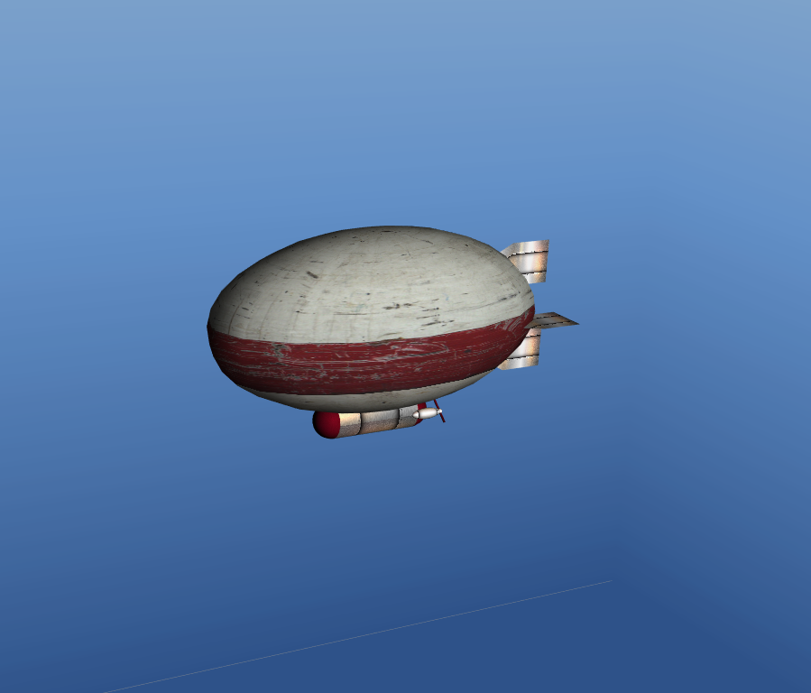
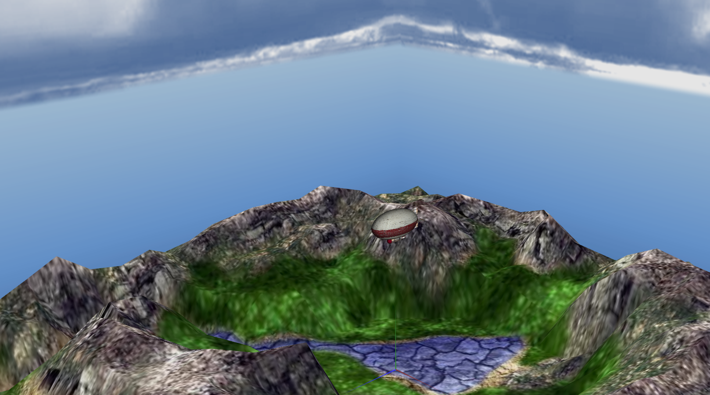
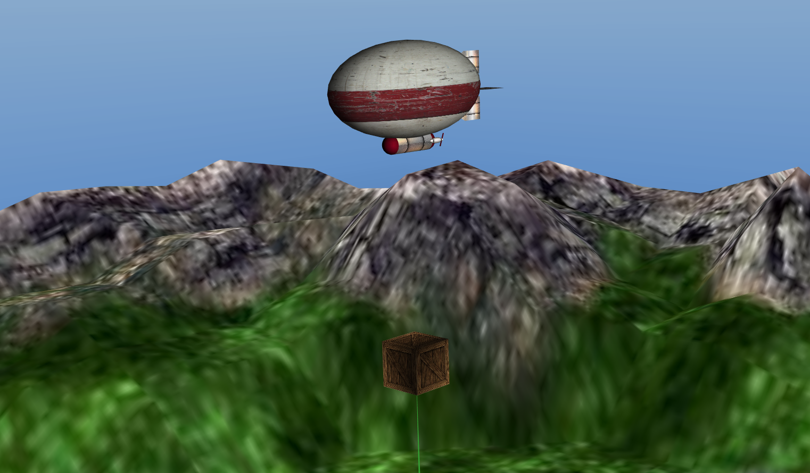
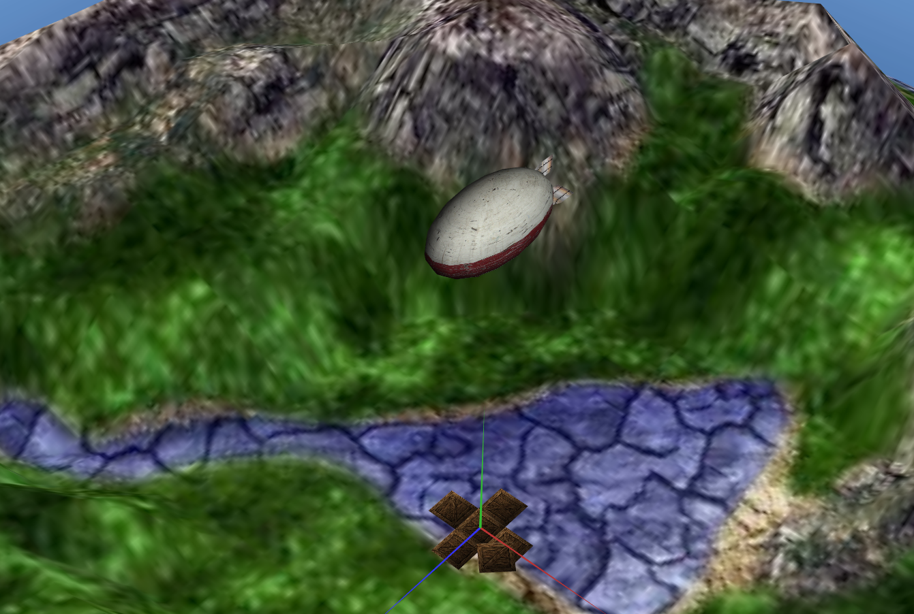
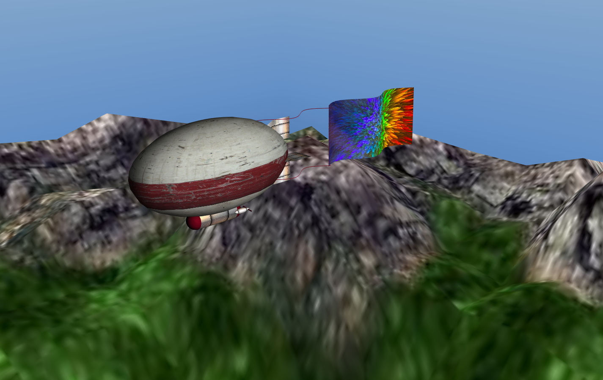
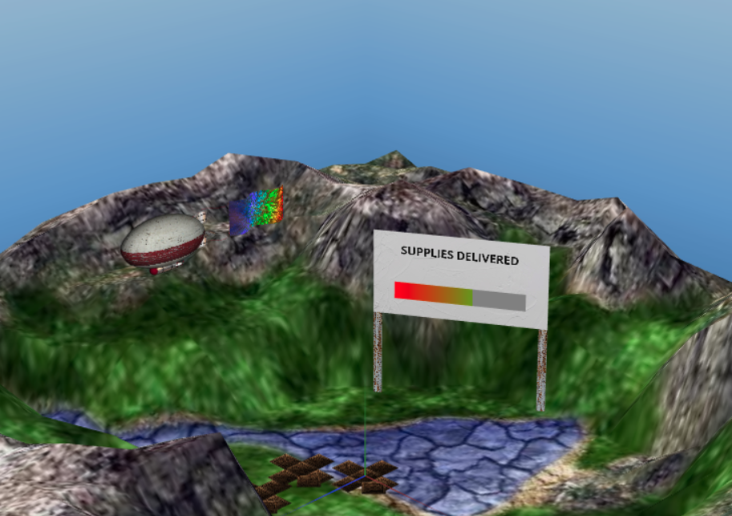

zeppelin-supplier
------------------

This project aims to create a graphical scene of a zeppelin dropping some supplies, with OpenGl technology. 
Available at https://edurbrito.github.io/zeppelin-supplier/proj/index.html.

## Instructions

|Camera Movement|Mouse grabbing|
|----|----|
|Vehicle Movement|W,S,A,D keys|
|Auto Pilot|P key|
|Dropping the Supplies|L key|
|Restart|R key|

## Source

Mainly developed using Javascript, the classes and primitives created can be found inside the [`proj`](proj) folder.

Primitives:
* Sphere
* Cube
* Cylinder
* Plane
* Quad

Composed Objects:
* Billboard
* Supply
* Terrain
* Vehicle

Shaders:
* Billboard progress bar
* Flag waving
* Terrain topology

## Screenshots

|||
|----|----|
|||
|||

## Authors

This project was developed by 
* Diana Freitas, [@dianaamfr](https://github.com/dianaamfr)
* Eduardo Brito, [@edurbrito](https://github.com/edurbrito)
